# Paddy Leaf Disease Classification Using a Hybrid Model of ResNet50 and Vision Transformer

A deep learning-based image classification system developed as an undergraduate final-year project for automated identification of paddy leaf diseases. The system combines **ResNet50** and **Vision Transformer (ViT)** to learn complementary local and global visual features and classify paddy leaf images into four categories.

## Overview

The system combines:

- **ResNet50** for local spatial and texture feature extraction
- **Vision Transformer (ViT)** for global feature extraction
- **Feature fusion** to combine the two representations
- A fully connected classification head for final prediction

The model classifies paddy leaf images into:

1. Bacterial Leaf Blight
2. Brown Spot
3. Leaf Smut
4. Healthy

## Project Objectives

- Develop an automated paddy leaf disease classification system.
- Combine CNN-based and Transformer-based feature extraction.
- Capture complementary local and global visual information.
- Evaluate the hybrid model using classification metrics and visualizations.
- Demonstrate image-based disease classification.

## Model Architecture

### Feature Extraction

**ResNet50**
- Extracts a 2048-dimensional feature representation.

**Vision Transformer (ViT)**
- Extracts a 768-dimensional feature representation.

### Feature Fusion

The two feature vectors are concatenated:

```text
ResNet50 features: 2048
ViT features:       768
                    ----
Fused features:    2816
```

The fused representation is passed through the classification head:

```text
2816
  ↓
Fully Connected Layer (512)
  ↓
ReLU
  ↓
Dropout (0.3)
  ↓
Fully Connected Layer (4)
  ↓
Softmax
  ↓
Predicted Disease Class
```

### Architecture Diagrams

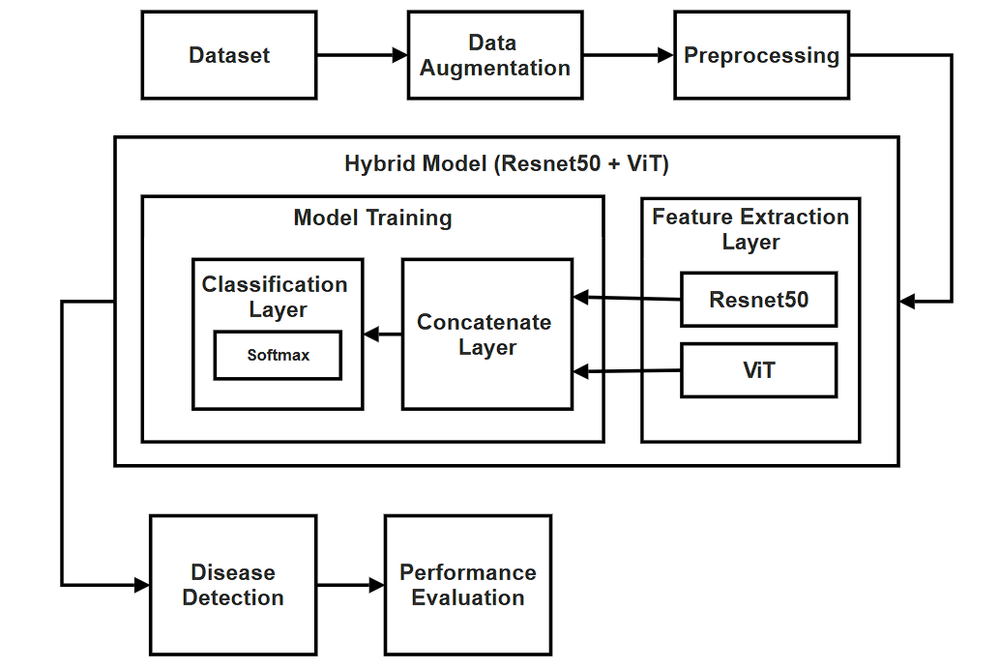

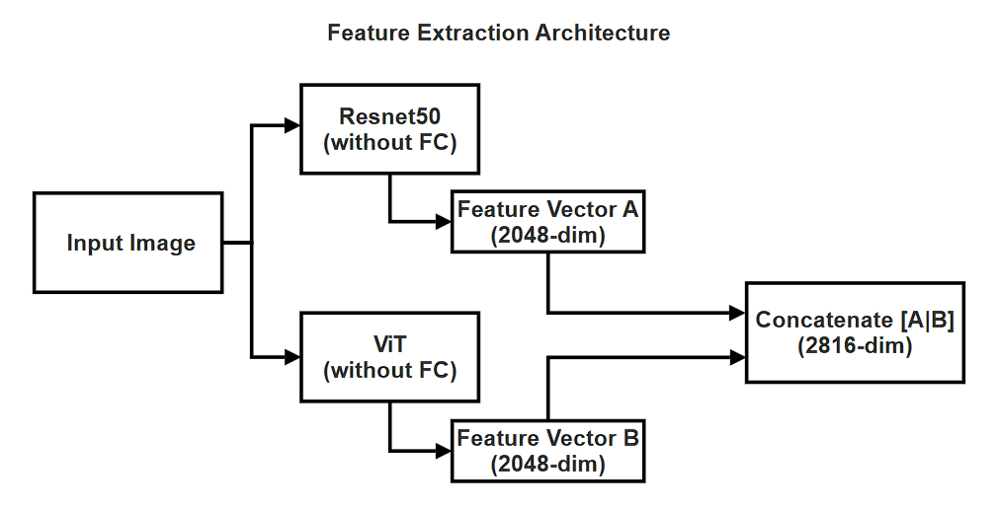

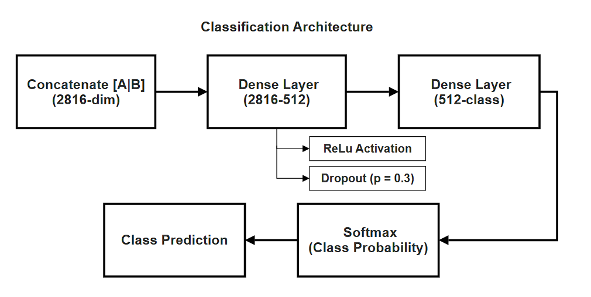

## Dataset

The classification dataset was assembled from multiple publicly available resources and organized for this project.

The four classes are:

| Class | Category |
|---|---|
| Bacterial Leaf Blight | Diseased |
| Brown Spot | Diseased |
| Leaf Smut | Diseased |
| Healthy | Healthy |

The complete external dataset is not redistributed in this repository.

## Preprocessing and Training

The project uses PyTorch for model development and training.

| Parameter | Value |
|---|---|
| Framework | PyTorch |
| Input Size | 224 × 224 |
| Batch Size | 32 |
| Learning Rate | 1e-3 |
| Optimizer | Adam |
| Scheduler | OneCycleLR |
| Loss Function | CrossEntropyLoss |
| Dropout | 0.3 |
| Number of Classes | 4 |
| Training Environment | Google Colab |

## Dataset Visualization

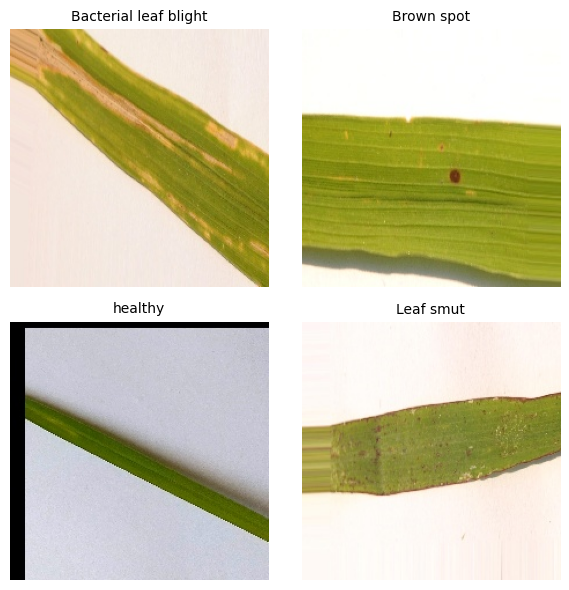

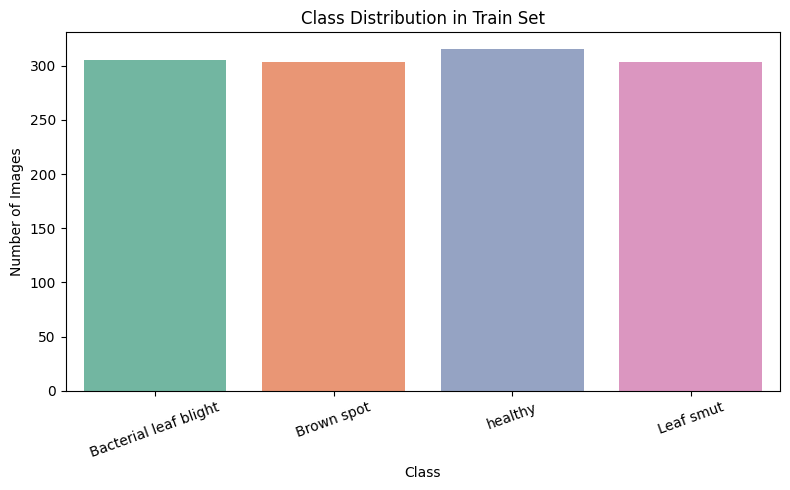

## Evaluation

The model development includes:

- Accuracy tracking
- Loss tracking
- Learning-rate tracking
- Confusion matrix analysis
- Classification evaluation
- Sample image inference

### Accuracy

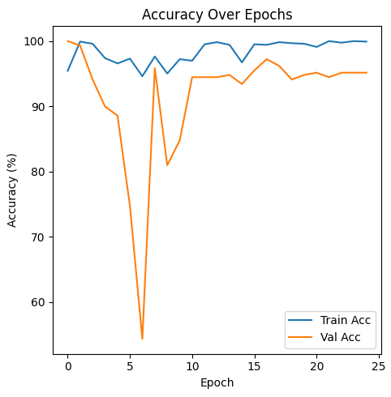

### Loss

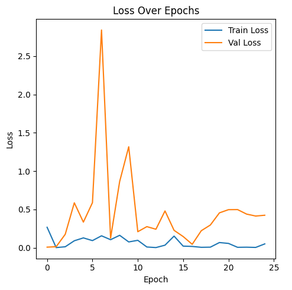

### Learning Rate

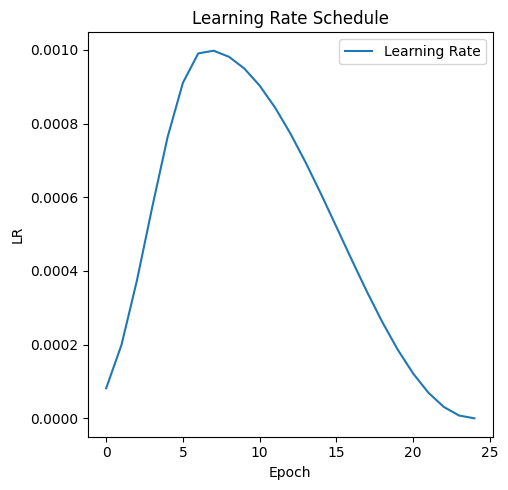

### Confusion Matrix

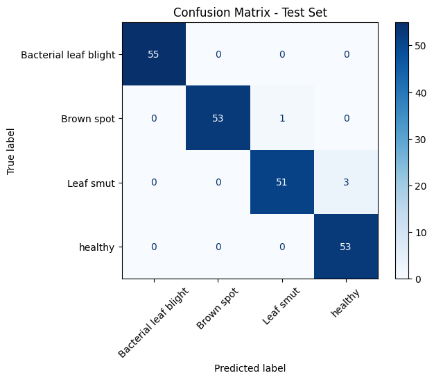

## Inference Output

### Final Output

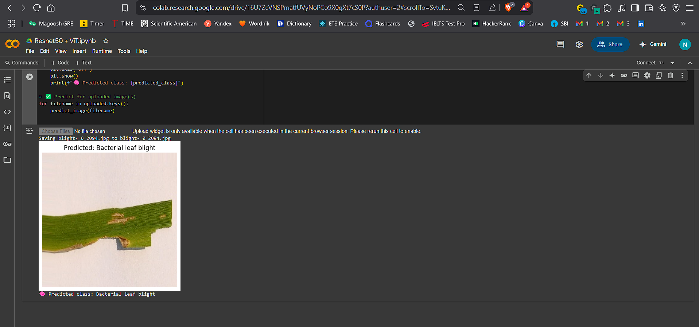

### Multiple Image Output

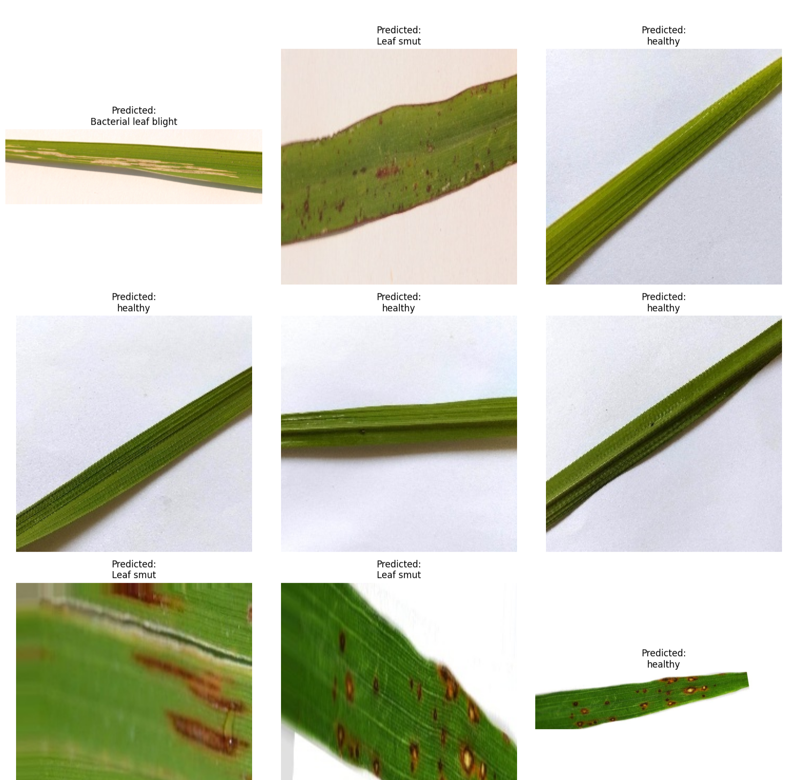

## Implementation

The repository contains the Jupyter notebooks used for dataset preparation, model development, and evaluation.

```text
codes/
├── 01_preprocessing_augmentation.ipynb
├── 02_dataset_visualization.ipynb
├── 03_resnet50_vit_training.ipynb
├── 04_resnet50_baseline.ipynb
└── 05_model_evaluation_visualization.ipynb
```

## Trained Model

The trained **ResNet50 + ViT** model is hosted separately because the model file is larger than GitHub's standard individual-file limit.

[Download ResNet50 + ViT Model](https://drive.google.com/drive/folders/1ndGRWob8mA_3qMZ7yc8O0CMHyJGU9Hv-?usp=sharing)

## Demo

Project demonstration videos are hosted separately.

[View Demo Videos](https://drive.google.com/drive/folders/1DpmfWb9EAMEVI_yeBj0JPz_Hj4FfGd7b?usp=sharing)

## Documentation

The repository includes the project documentation and presentation materials:

```text
docs/
├── final_report_v1.pdf
├── Noorul_final_review.pptx
└── abstract.pdf
```

## Repository Structure

```text
paddy-leaf-disease-classification-resnet50-vit/
│
├── codes/
│   ├── 01_preprocessing_augmentation.ipynb
│   ├── 02_dataset_visualization.ipynb
│   ├── 03_resnet50_vit_training.ipynb
│   ├── 04_resnet50_baseline.ipynb
│   └── 05_model_evaluation_visualization.ipynb
│
├── images/
│   ├── 01_overall_architecture.png
│   ├── 02_feature_extraction_architecture.png
│   ├── 03_classification_architecture.png
│   ├── 04_disease_classes.png
│   ├── 05_class_distribution.png
│   ├── 06_accuracy_graph.png
│   ├── 07_learning_rate_graph.png
│   ├── 08_loss_graph.png
│   ├── 09_confusion_matrix.png
│   ├── 10_final_output.png
│   └── 11_multiple_image_output.png
│
├── model/
│   └── README.md
│
├── demo/
│   └── README.md
│
├── docs/
│   ├── final_report.pdf
│   ├── presentation.pptx
│   └── abstract.pdf
│
├── LICENSE
└── README.md
```

## Future Scope

Potential future work includes:

- Expanding the classification dataset and disease categories
- Testing with field-acquired images
- Optimizing the model for edge or mobile deployment
- Developing a real-time inference interface

## Author

**Noorul Hassan**

[GitHub](https://github.com/noorul23)

## License

This project is licensed under the MIT License. See the [LICENSE](./LICENSE) file for details.
